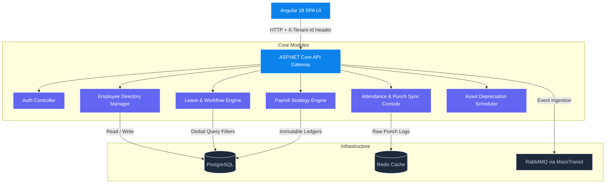

# 🏢 Enterprise HRMS & Payroll Platform

> A production-grade, multi-tenant **Human Resource Management System** and **Payroll Automation Platform** engineered with **ASP.NET Core 8**, **Angular 18**, **PostgreSQL**, **Redis**, and **RabbitMQ** — wrapped in a stunning dark-mode glassmorphic UI powered by ApexCharts.

---

## 📐 System Architecture

The platform is built around a **Modular Monolith** philosophy with clean domain-driven boundaries — designed for a seamless future transition into microservices via event-driven messaging.



### Architecture Highlights

| Concern | Implementation |
|---|---|
| **Multi-Tenancy** | Every request carries an `X-Tenant-Id` header; EF Core Global Query Filters enforce row-level data isolation per tenant |
| **Case-Folding Safety** | A custom naming mapper in `OnModelCreating` normalizes all entity/column names to lowercase, resolving PostgreSQL quoting conflicts with Npgsql |
| **GAAP Audit Compliance** | Ledger records are structurally immutable — no hard deletes. Corrections are applied as balancing negative offset entries |

---

## 💎 Feature Modules

### 🏝️ Leave & Workflow Management
- **Employee Portal** — Submit leave requests with real-time balance checks and date-overlap conflict guards
- **HR Manager Inbox** — Multi-level routing with role-gated approve/reject controls (HR role only)
- **Visual Balances** — Radial Bar Gauges displaying Casual, Sick, Earned, and PTO leave against annual allocations

### 📅 Attendance Tracker & Terminal
- **Punch IN / OUT Terminal** — Web-based biometric emulation with a live session work timer
- **Duplicate Punch Guard** — Enforces a 60-second cooldown window to prevent double-taps or sensor misfires
- **Daily Consolidation** — Merges raw punch records by business date, calculating standard hours vs. overtime against configurable tolerance thresholds
- **Auto Profile Resolution** — Identifies the active employee from the logged-in email and auto-assigns punch cards for both employee and HR roles

### 💳 Payroll Automation Engine
- **Multi-Region Tax Strategies** — Country-specific computation pipelines for **India ₹**, **US $**, **UK £**, and **UAE AED**
- **Tax Slab Processing** — Handles standard deductions, professional tax, FICA (7.65%), NI (8%), and PF contributions (12%)
- **Salary Ledger** — Interactive donut chart visualizing take-home pay vs. total deductions per pay cycle

### 💻 Asset Depreciation Scheduler
- Hardware inventory catalog with per-employee assignment tracking
- Straight-line depreciation widget:

$$\text{Current Value} = \text{Purchase Cost} - (\text{Annual Depreciation Rate} \times \text{Years in Service})$$

---

## 🚀 Getting Started

### Prerequisites

| Requirement | Notes |
|---|---|
| **Docker Desktop** | Required for containerized stack |
| **Node.js v20+** | Only if running frontend outside Docker |
| **.NET 8.0 SDK** | Only if running backend outside Docker |

---

### ▶ Method A — Full Docker Stack *(Recommended)*

Spins up all five services in isolated containers with a pre-seeded PostgreSQL schema, active Redis cache, and RabbitMQ messaging.

```bash
docker-compose up --build -d
```

**Expected running containers:**

| Container | Status | Endpoint |
|---|---|---|
| `hrms-frontend-ui` | 🟢 Up | `http://localhost:4200` / `:80` |
| `hrms-backend-api` | 🟢 Up | `http://localhost:5000` |
| `hrms-db` | 🟢 Healthy | PostgreSQL on `:5432` |
| `hrms-messaging` | 🟢 Up | RabbitMQ on `:5672` / `:15672` |
| `hrms-cache` | 🟢 Up | Redis on `:6379` |

Open **[http://localhost:4200](http://localhost:4200)** once all containers are healthy.

---

### ⚙️ Method B — Local Development Mode *(Hot Reload)*

Run backend and frontend directly on your machine with live reload, while keeping infrastructure services in Docker.

**Step 1 — Start infrastructure only:**
```bash
docker-compose up -d db cache messaging
```

**Step 2 — Start ASP.NET Core API:**
```bash
cd backend
dotnet run
# Listening at http://localhost:5000
```

**Step 3 — Start Angular Dev Server:**
```bash
cd frontend
npm install --legacy-peer-deps
npx ng serve --open
# Opens http://localhost:4200 automatically
```

---

## 🔑 Seed Test Accounts

> The auth server parses roles from email keywords and accepts **any non-blank password**.

### 🇮🇳 Tenant — Capgemini India

| User | Role | Email | Password | Access |
|---|---|---|---|---|
| HR Manager | HR / Manager | `hr@capgemini-in.com` | `Admin@1234` | Employee directory, payroll runs, asset registry, punch, **leave approvals** |
| Amit Sharma | Employee | `amit.sharma@capgemini-in.com` | `Password123` | Leave submission, punch, personal balance view |
| Rajesh Kumar | Employee | `rajesh.kumar@capgemini-in.com` | `Password123` | Leave submission, punch, personal balance view |
| Super Admin | SuperAdmin | `hr.admin@capgemini-in.com` | `Admin@1234` | Tenant registration, global HR/employee management |

### 🇺🇸 Tenant — Capgemini USA

| User | Role | Email | Password | Access |
|---|---|---|---|---|
| Sarah Connor | HR / Employee | `sarah.connor@capgemini-us.com` | *(any)* | Hybrid HR + employee access for US tenant |
| John Doe | Employee | `john.doe@capgemini-us.com` | *(any)* | US employee punches and leave submissions |

---

## 📂 Project Structure

```
.
├── backend/
│   ├── src/
│   │   ├── HRMS.API/             # Controllers, Auth, API Gateway entry point
│   │   ├── HRMS.Application/     # Use cases, DTOs, command/query handlers
│   │   ├── HRMS.Core/            # Domain entities and interfaces
│   │   └── HRMS.Infrastructure/  # EF Core context, Redis, RabbitMQ clients
│   └── Dockerfile                # Multi-stage .NET build
│
├── database/
│   └── init.sql                  # Pre-seeded PostgreSQL schema + indices
│
├── frontend/
│   ├── src/
│   │   ├── app/
│   │   │   ├── core/             # Auth guards, interceptors, services
│   │   │   ├── features/         # Dashboard, Leave, Attendance, Payroll, Assets, Tenants
│   │   │   ├── layouts/          # Side-nav shell templates
│   │   │   └── shared/           # Directives, models, shared UI modules
│   │   └── styles.css            # Tailwind + glassmorphism theme overrides
│   └── Dockerfile                # Multi-stage Angular + Nginx build
│
└── docker-compose.yml            # Full-stack orchestration config
```

---

## 🛠️ Troubleshooting

**PostgreSQL Case-Sensitivity Crashes**
Npgsql quotes identifiers (e.g. `o."Id"`), while PostgreSQL folds unquoted names to lowercase. This is globally resolved inside `ApplicationDbContext.OnModelCreating` using a lower-invariant naming convention.

**Angular Deep-Link 404s (Nginx)**
The Nginx config includes a `try_files $uri $uri/ /index.html` fallback rule, ensuring direct page reloads and deep links resolve correctly in the SPA.

**Kestrel HTTP Binding in Docker**
SSL certificates are not required inside Docker virtual networks. The backend binds to HTTP port 5000 via the `ASPNETCORE_URLS` environment variable to avoid certificate mounting issues.